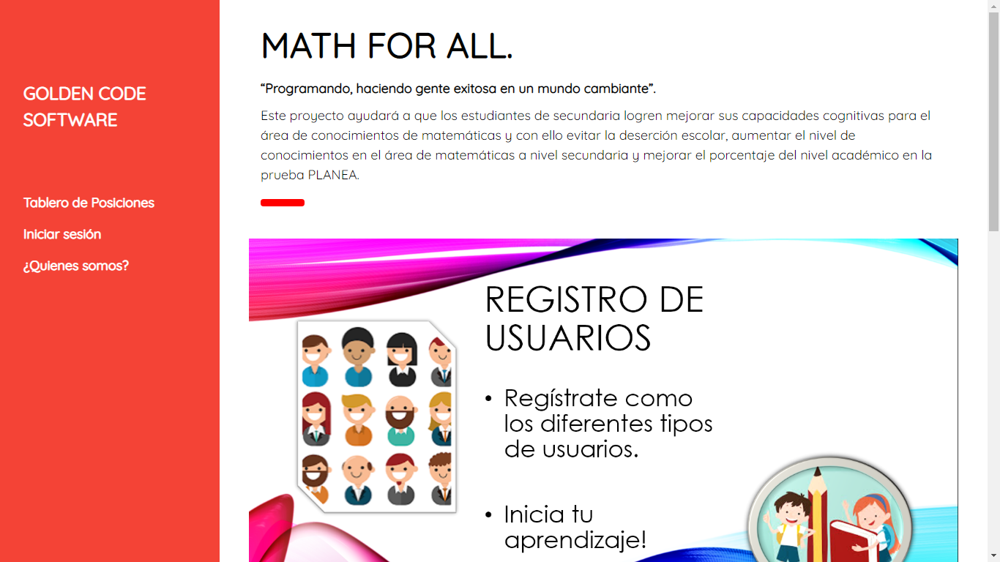

# Math For All

## Description
Educational website designed to reduce students' rejection for study lessons, promote healthy competition
among students, improve the test application process, and facilitate the access to students' data.

## Features

### Lessons and exercises

### Level system and competitive scoreboard

### Test Maker

### Students record

## Notes
This is an UNFINISHED schoolar project
