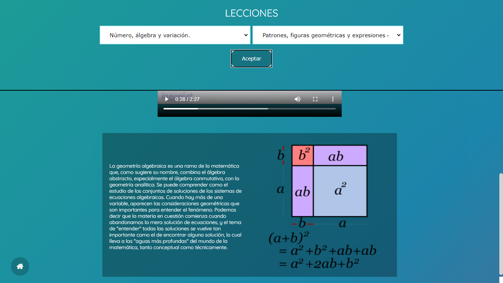
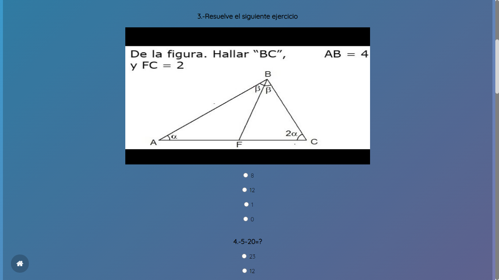
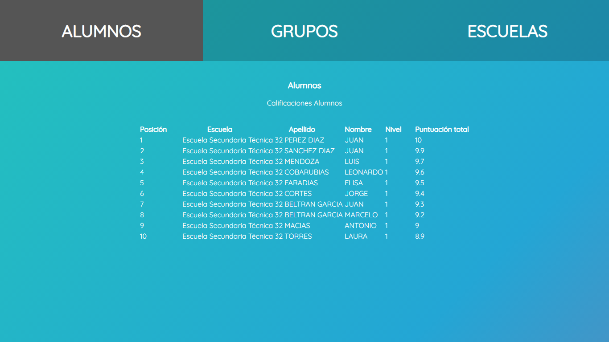
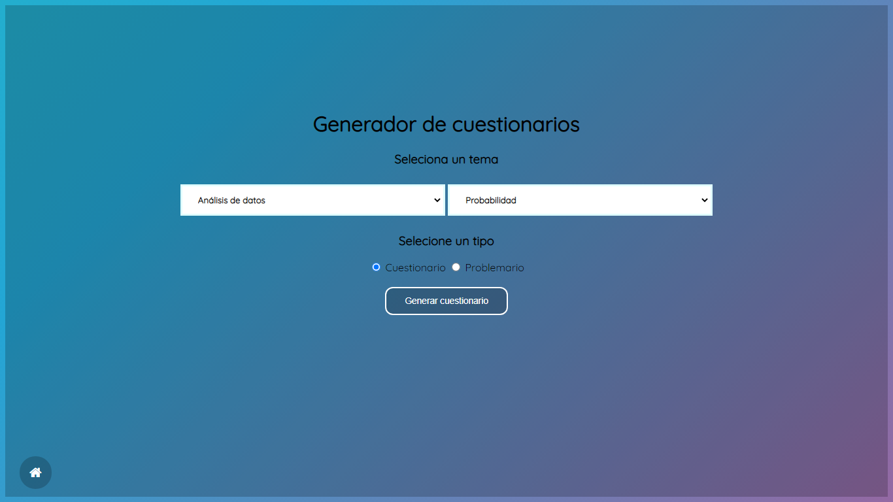
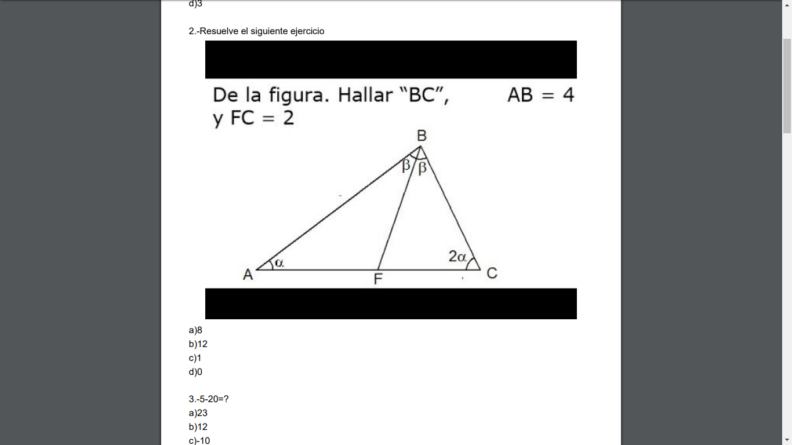

# Math For All

## Description
This is an UNFINISHED schoolar project about an educational website designed to reduce students' rejection for study lessons, promote healthy competition
among students, improve the test application process, and facilitate the access to students' data.

## Features

### Lessons and exercises
Online lessons of different subjects that compliments on-site ones and online exercises that are classified by subject and levels of difficulty

 

### Level system and competitive scoreboard
By solving exercises students will gain points and get a level and based on the points they will get a position on a public scoreboard

 

### Test Maker
Teachers can make and print tests of a specific subject and difficulty level just by selecting them

 

## Notes
Made from 02/2018 to 05/2018
